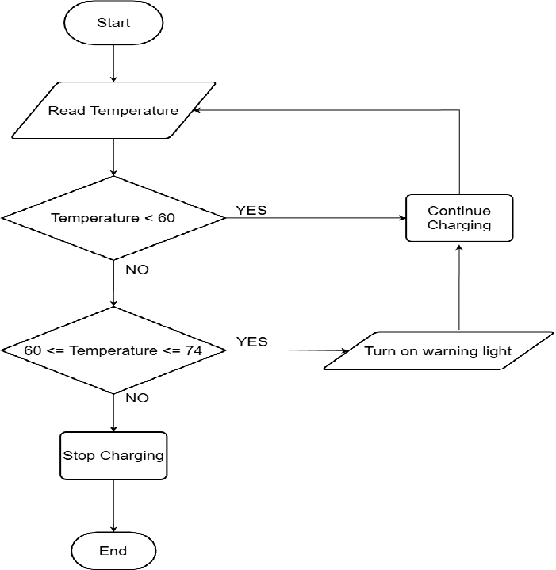
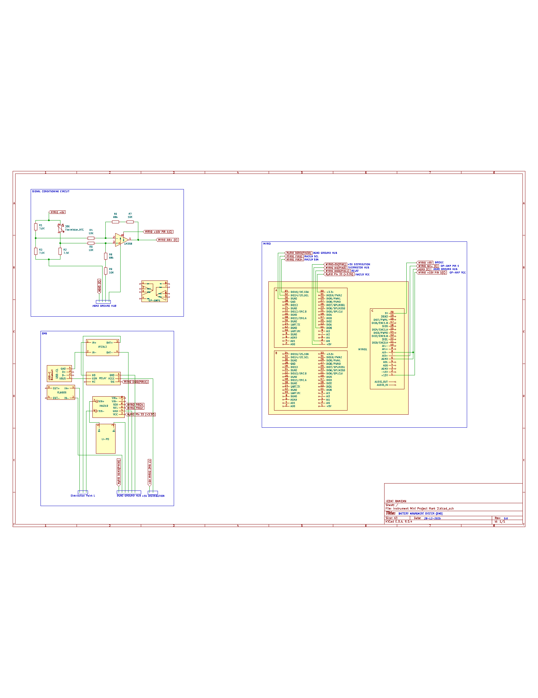
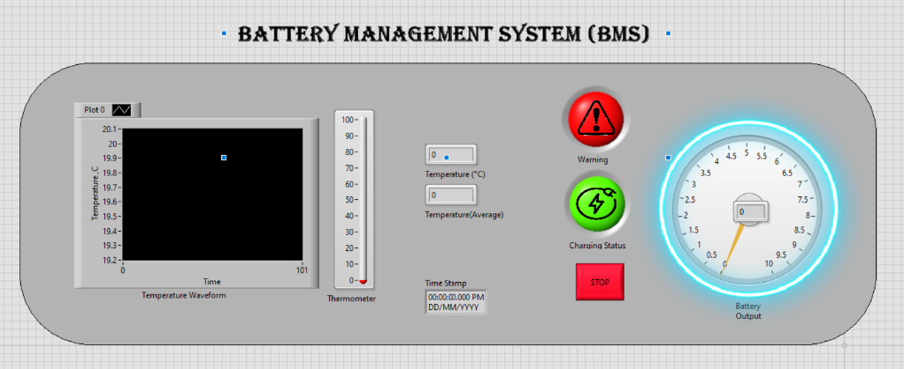
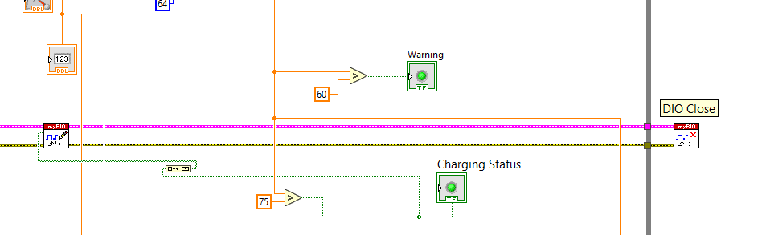

# Automated Battery Management System (BMS) | EV Thermal Control

## Overview
This project focuses on the design and implementation of a safety-critical Battery Management System (BMS) specifically engineered for Electric Vehicle (EV) applications. The system monitors thermal performance using an NTC 30kΩ thermistor to prevent accidental fire and battery degradation. It features automated safety protocols that trigger warning indicators at 60°C and execute a full power cut-off via a 5V relay when temperatures reach 75°C.

[View Full Technical Report](./BMS_Technical_Report_Izzat.pdf)

## Technical Architecture
The system utilizes a hybrid approach of analog signal conditioning and virtual instrumentation
*  **Transducer:** NTC 30kΩ Thermistor (Negative Temperature Coefficient).
* **Signal Conditioning:** A Wheatstone bridge and LM358 operational amplifier circuit provide a calculated gain of 7.8.
* **Processing Unit:** NI myRIO Embedded Controller.
* **Software:** LabVIEW graphical development environment for real-time DAQ and control logic.

## How It Works
The system operates through a structured "Physical-to-Digital" pipeline to ensure battery safety.
1. **Sensing & Conditioning:** The **30kΩ NTC thermistor** detects thermal variations, which are converted into a differential voltage by a **Wheatstone bridge** This small signal is amplified by the **LM358 op-amp** with a gain of **7.8** to provide a stable 0-5V range for the controller.
2. **Data Acquisition (DAQ):** The **NI myRIO** converts this analog signal into digital data. Inside LabVIEW, a **MathScript Node** applies the **Beta parameter equation (β=3950)** to accurately calculate the real-time temperature in Celsius.
3. **Automated Response:** * If temperature is **< 60°C**, the battery continues charging normally.
    * If temperature is **60°C – 74°C**, the **Warning LED** activates to alert the user.
    * If temperature exceeds **74°C**, the system triggers a **5V relay** via the **DIO channels** to instantly cut power and prevent thermal runaway.

## Key Features
* **Precision Thermal Monitoring:** Converts raw voltage into accurate Celsius readings using real-time algorithmic processing.
* **Dual-Stage Safety Protocol:** Provides both user notification and autonomous hardware protection.
* **Real-Time Visualization:** Professional LabVIEW Front Panel featuring temperature graphs, thermometers, and digital voltage gauges.
* **Data Logging:** Records temperature and battery voltage to internal myRIO memory for post-operational analysis.

## Performance Verification
The system was verified by comparing theoretical calculations against actual measured values:

| Temperature | Theoretical Output | Measured Output | Charging Status |
| :--- | :--- | :--- | :--- |
| **60°C** | 0.00V | 0.08V | Normal (Warning Active)  |
| **75°C** | 5.015V | 4.98V  | **Power Cut-off Triggered**  |

## System Documentation

### System Flowchart

### Signal Conditioning Schematic

### LabVIEW Front Panel

### Actuator Control Logic

